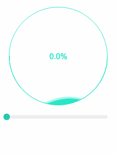

# 波浪进度指示器
灵感来自开发者头条介绍的iOS版[波浪进度加载指示器](http://toutiao.io/posts/o6c3dx)，用js仿写了一个。

## 动画演示 [网页演示](http://newraina.github.io/waveLoading.js/demo/)

  

## 使用
- `waveLoading.init(options)` 初始化
- `waveLoading.draw()` 绘制动画
- `waveLoading.setProgress(num)` 动画执行过程中控制进度（0 ~ 100）

## 配置
所有选项在`init()`参数中配置：
- `target`
绘制目标，可以是canvas元素或者其选择器，若不设置，会从文档中选择第一个canvas元素作为绘制目标
- `speed`
波浪运行速度倍率，默认为1
- `color`
全局主题颜色，默认为`rgba(40, 230, 200, 1)`
- `alpha`
全局透明度，默认为1
- `lineWidth`
圆形容器的边框宽度，默认为1
- `showText`
是否显示进度提示文字（百分比），默认不显示
- `textSize`
进度提示文字的大小，默认16px
- `textColor`
进度提示文字的颜色，默认为主题色
- `bgColor`
文字被波浪动画遮盖时的颜色，默认为白色
- `fontFamily`
进度提示文字使用的字体，默认为`Helvetica, Tahoma, Arial, STXihei, "华文细黑", "Microsoft YaHei", "微软雅黑", sans-serif`
- `fontWeight`
进度提示文字的字重，默认为`lighter`
- `callback`
进度完成后执行的回调函数

## 计划中
- [ ] 进度改变时平滑移动，带有缓冲效果，而不是现在的生硬上升
- [ ] 波浪平坦程度调节
- [ ] 前后波浪相位差调节
- [ ] 前后波浪速度差调节
